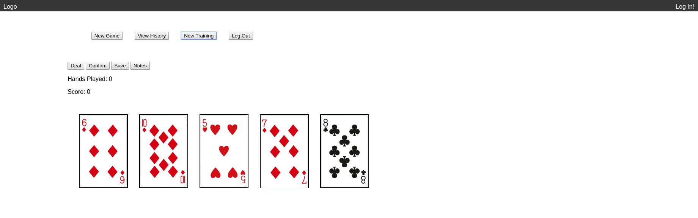

This project was bootstrapped with [Create React App](https://github.com/facebook/create-react-app).

Screenshots of your app
A description of your tech stack
A brief description of where each of the key parts of the project live in your codebase
If your app is meant to be re-used by other developers, instructions on how to get the app up and running

### VPoker 
Vpoker is an app designed to allow you to maximize your video poker skills through training or through live use with input on the game page. It has functionality to track your training history as well. 

### FAIR WARNING 

The current logic dictating the holds is not optimized for live play! It is strictly place holder to return the best current hand

### Live APP

https://pcap-client.herokuapp.com

splash page image

training page image

log in page image

game play image

### Tech Stack

this game utilizes react and redux to mage state and front end management
It is provider wrapped and targeted via App component to various other
components

The game utilizes mongoDb for back end database management for user authentication, note taking, 
history, and utilizes JWT authentication for user security

The game also uses 2 NPM libraries the first being the poker deck library 
npm cards manages the ability to create random hands for training

Also until the logic is built in house it uses npm pokersolver to display
results of poker hands (This is place holder for the actual logic which is 
in development via a team).

### Dependencies:
    "cards": "^1.0.1",
    "jquery": "^3.3.1",
    "jwt-decode": "^2.2.0",
    "mongodb": "^3.1.9",
    "pokersolver": "^2.1.2",
    "react": "^16.6.3",
    "react-dom": "^16.6.3",
    "react-poker": "0.0.77",
    "react-redux": "^5.1.1",
    "react-router-dom": "^4.3.1",
    "react-router-redux": "^4.0.8",
    "react-scripts": "2.1.1",
    "redux": "^4.0.1",
    "redux-form": "^7.4.2",
    "redux-thunk": "^2.3.0"

### Key components

The app uses 4 sets of action auth, game, users, and utils for state management
It also handles the actions through 2 reducers auth and game which are combined 
via middleware.
App is Provider wrapped in index.js and and controls the following components

splash.js which gives a landing page and description
main.js which controls navigation of app features
login.js which controls authentication and log in of users
training.js which controls simple automatic gameplay for training those new to poker
history.js in which a user can see their progress in working with the trainer
game.js which controls the main game flow for live use
history.js which shows a user their tracked sessions of training including notes they keep
logout.js which ends a users tracked session and stores data of that session in users history

### This app is currently still under developmentg by the team at Smiling Man Entertainment and is not 
### meant to be used for actual casino success at this time. 
### use at your own risk!